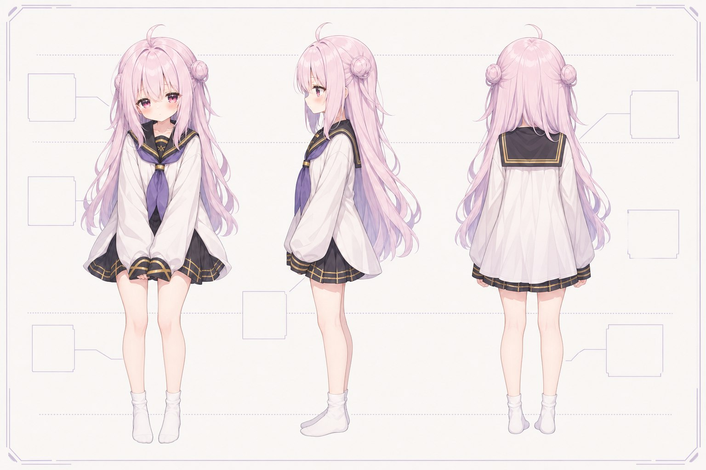
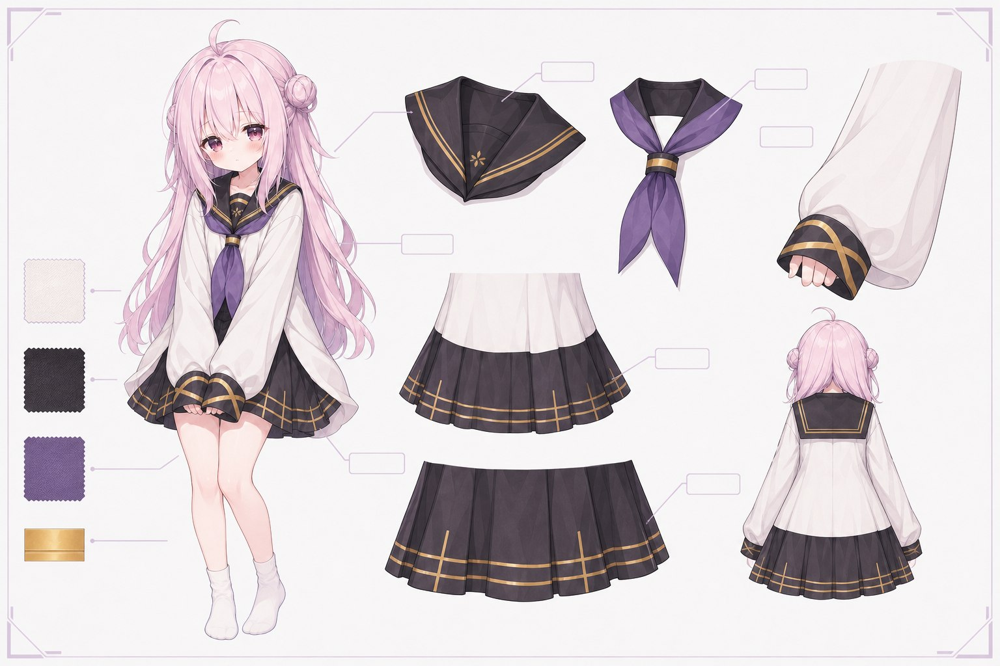
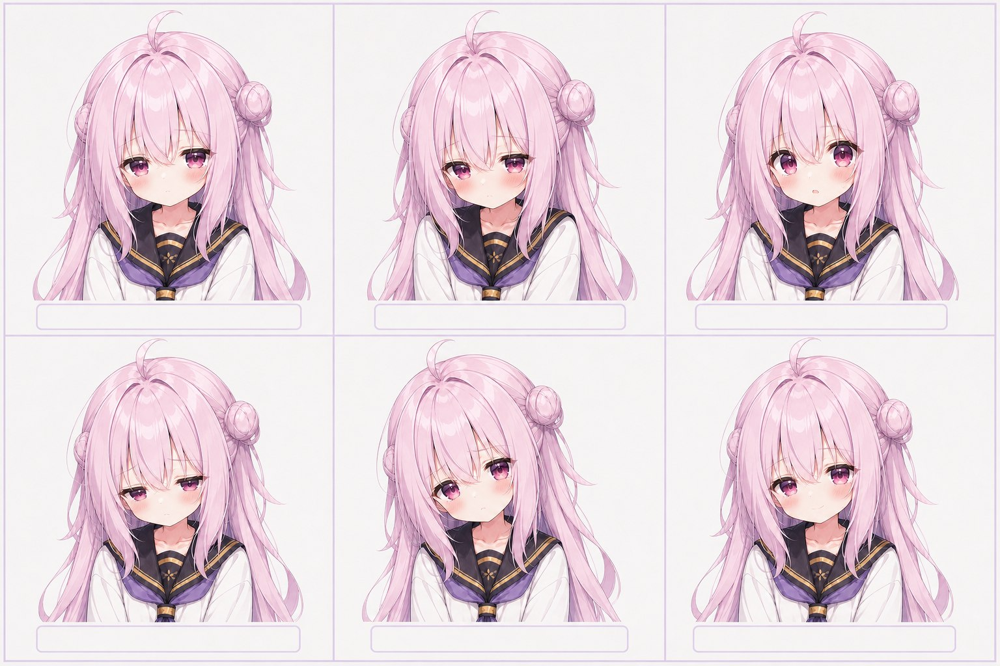
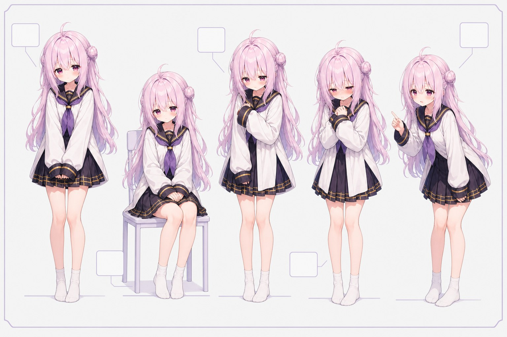

<div align="center">

# Yukikaze Live AI

**给 B 站直播间准备的一套本地 AI 对话、TTS、记忆与画面桥接工具** `(≧▽≦)ゞ`


[](https://nodejs.org/)
[](./LICENSE)
[](./docs/TESTING.md)

</div>

> 雪风不是一个只会一问一答的文本框。她能看见直播间事件、维持短期与长期记忆、选择是否联网搜索、通过 TTS 说话，并把台词、对话和点歌日志分别送到直播画面里 `( •̀ ω •́ )✧`

## ✨ 能做什么

- **AI 直播互动**：读取弹幕、进房、关注、礼物、醒目留言、在线榜等事件，交给雪风在合适的时机判断是否回复。
- **短期与长期记忆**：当前话题、直播气氛和最近互动进入短期记忆；反复出现或明确重要的信息可沉淀为长期记忆。
- **本地 GPT-SoVITS TTS**：人工台词与 AI 台词可使用独立 TTS 配置，按句排队合成并顺序播放，避免语音互相打断。
- **直播画面分层**：白框台词、雪风最近发言和 BiliNCM 点歌日志分别提供浏览器源 URL，直播姬里自由排版。
- **MCP 联网搜索**：支持腾讯云联网搜索 MCP。雪风可根据问题决定是否搜索，并让结果参与当前回答和记忆判断。
- **离线测试聊天**：不开播也能在控制台和雪风对话，走与真实直播相同的 AI、TTS、字幕和记忆链路。
- **BiliNCM 协作**：通过本地接口读取点歌器状态，配合 VoiceMeeter 决定音乐输出到直播、媒体或两者。

## 🧠 工作方式

```text
直播事件 / 离线测试
        ↓
上下文筛选 + 短期记忆 + 长期记忆
        ↓
雪风判断：回复谁、是否搜索、是否说话
        ↓
AI 台词 → TTS 队列 → 音频输出
        ↓
白框字幕 / 发言框 / 点歌日志 / 可选真实弹幕
```

角色设定始终优先于记忆；实时搜索结果优先于旧事实。记忆用于保持连续性，不会自动改写人设。

## 🚀 快速开始

1. 安装 **Node.js 20+**，并确认 `node -v` 能运行。

2. 在项目目录执行：

   ```powershell
   npm ci
   npm test
   ```

3. 双击 `start_dialogue_bridge.bat`，或运行：

   ```powershell
   npm run dialogue-bridge
   ```

4. 打开控制台：<http://127.0.0.1:17374/control>

5. 填写自己的 B 站房间、AI API、TTS 路径和参考音频，再保存配置。

详细步骤见 [快速开始](./docs/QUICKSTART.md) 和 [配置说明](./docs/CONFIGURATION.md)。第一次先用离线测试聊天验证，再接入直播会更稳妥喔 `(｡･ω･｡)`。

## 🌸 雪风设定

<div align="center">
  
  
</div>

<div align="center">
  
  
</div>

雪风是低能量、怕生而不失温柔的虚拟主播。银紫长发、黑白紫的水手服与微弱的粉色表情构成她的识别点；默认表情克制，害羞、困惑、低落和短暂的元气笑留给观众互动时出现。

## 🌧 雪风印象

<div align="center">
  
</div>

<div align="center">
  
  
  
</div>

<div align="center">
  
</div>

雨夜不是单纯的背景。远处的城市灯光、窗上的水痕、桌边的热水和安静的房间，共同构成一种清冷、寂静但不疏离的陪伴感。雪风不需要一直热闹；她可以听、可以停顿，也会在有人开口时努力靠近一点。

第一版直播形象也因此保持稳定与精简：优先半身、自然口型、眼神、呼吸和头发物理，让画面在长时间直播里依然清楚、安静、可读。

仓库内还附带一套可选的无字雨夜直播组件，可在 [`assets/stream-kit/rainy-night`](./assets/stream-kit/rainy-night/README.md) 查看。

## 🧩 配套素材

- [视觉素材与发布边界](./docs/ASSETS.md)
- [雪风角色简述](./docs/CHARACTER_BRIEF_ZH.md)
- [无字雨夜直播组件包](./assets/stream-kit/rainy-night/README.md)

## 👤 作者与联系

- 署名：**雪风智乃**
- QQ：`1061218535`
- B 站主页：[雪风智乃](https://space.bilibili.com/23547595)

## 📚 文档导航

- [快速开始](./docs/QUICKSTART.md)
- [配置说明](./docs/CONFIGURATION.md)
- [架构说明](./docs/ARCHITECTURE.md)
- [BiliNCM、VoiceMeeter 与 MCP](./docs/INTEGRATIONS.md)
- [测试与发布检查](./docs/TESTING.md)
- [开发状态与路线](./docs/DEVELOPMENT.md)
- [雪风人设模板](./docs/AI_PERSONA_TEMPLATE.md)
- [雪风设定与印象](./docs/CHARACTER_BRIEF_ZH.md)
- [视觉素材与发布边界](./docs/ASSETS.md)
- [安全说明](./SECURITY.md)

## ⚠️ 公开使用边界

本仓库不包含任何 API Key、B 站 Cookie、房间号、浏览器登录资料、模型权重、参考音频、聊天记录或记忆数据库。请不要把这些文件提交到 GitHub。

项目仅作为直播辅助工具。使用 B 站、网易云音乐、腾讯云、GPT-SoVITS、BiliNCM 与 VoiceMeeter 时，请分别遵守对应平台和软件的条款。

## 💖 致谢

- [GPT-SoVITS](https://github.com/RVC-Boss/GPT-SoVITS)
- [Model Context Protocol](https://modelcontextprotocol.io/)
- [WaveSurfer.js](https://wavesurfer.xyz/)
- [BiliNCM-TS](https://github.com/Enkianssus/BiliNCM-TS)
- [EchoBot](https://github.com/KdaiP/EchoBot) 的 README 组织方式提供了展示灵感。这里的文案和资源均为独立创作。

欢迎提交 issue、改进文档，或让雪风在你的直播间变得更自然一点点 `(^_^)ノ`。
